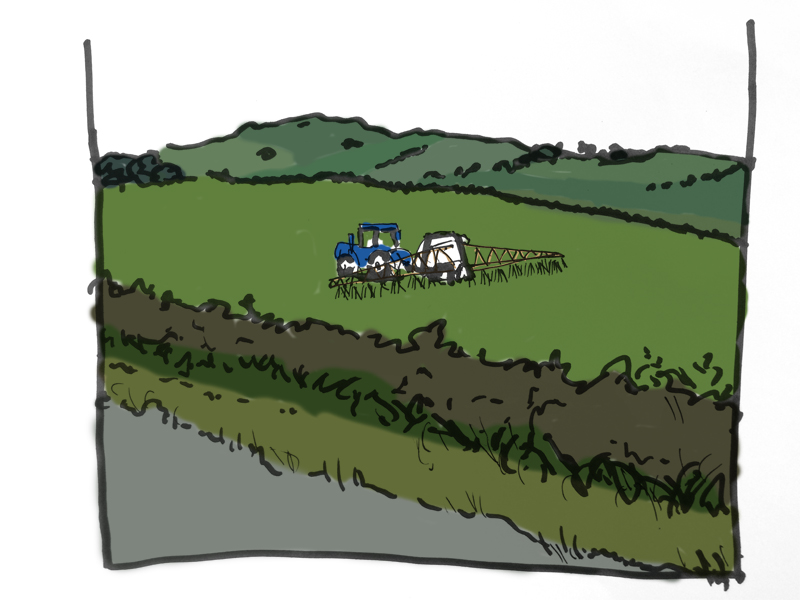
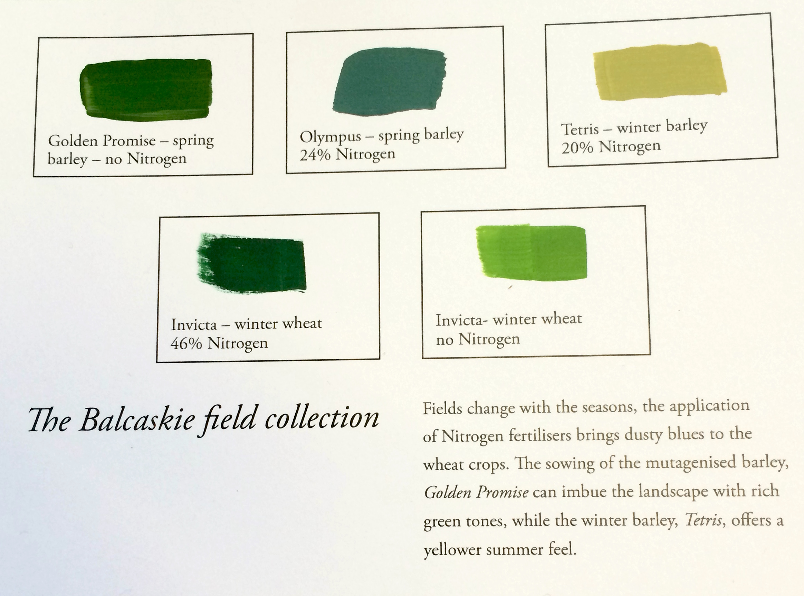

# The Balcaskie Field Collection

#### What we see in the countryside, the varieties of crops planted and amount of fertilisers used, paint the landscape around us. We have digitally sampled those colours and created an evolving colour palette and paint collection, bringing the land to the sea.

*Project by Rory Hamilton and Michelle Thorne*

“The land and the sea don’t talk to each other. We live with our backs to each other.”

Anstruther overlooks the sea. It’s oriented to the rhythms of maritime life. Inland, the countryside is coloured by its own practices.

We explored how to make the land more visible to the residents of the seaside village as well as provide qualitative information to the local farmers as they transition their fields from industrial to organic farming.

By applying samples from the Colour Harvester, we created the Balcaskie Field Collection, a colour palette taken from a large farming estate near Anstruther. We used these colours to paint model boats and other maritime items around Anstruther, striving to take the land to the sea through colour.

To take this project forward, one might compare the colour palette of different farms, which could provide a simple visual understanding of the ambitions, methods and biodiversity of a farm. Colour changes over time could be logged to understand how the fields have transformed with evolving farming practices.  Furthermore, paints could be complemented with digital displays or connected objects that convey the colour data in a dynamic way and would be viewable in the village, on the farm and around the world.
